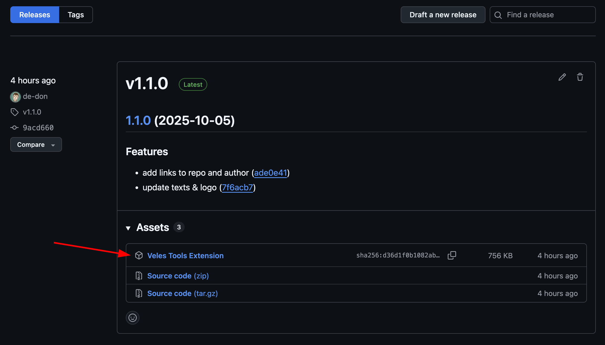

# Установка Veles Tools

Этот документ описывает все доступные способы установки расширения. Выберите тот, который подходит вам лучше всего.

## 1. Установка через Chrome Web Store
***Этот способ станет доступен после одобрения расширения модерацией Chrome WebStore.***

1. Откройте страницу расширения в Chrome Web Store (*ссылка будет доступна после публикации*).
2. Нажмите кнопку «Установить» и подтвердите действие во всплывающем диалоге.
3. Дождитесь появления иконки Veles Tools на панели расширений. При необходимости закрепите её через меню `Управление расширениями`.
4. Авторизуйтесь на [veles.finance](https://veles.finance/) и откройте попап расширения, чтобы запустить рабочую панель.

## 2. Установка из ZIP-архива последнего релиза
1. Перейдите на страницу релизов проекта: [github.com/de-don/veles-tools/releases](https://github.com/de-don/veles-tools/releases).
2. Скачайте архив `Veles Tools Extension.zip` из последнего релиза.
3. Распакуйте архив в удобную директорию. В распакованной папке должна быть структура `manifest.json`, `scripts/`, `ui/` и прочие ресурсы.
4. Откройте Chrome и перейдите в `chrome://extensions/`.
5. Включите «Режим разработчика» (Developer mode) в правом верхнем углу.
6. Нажмите «Загрузить распакованное» (Load unpacked) и укажите папку, в которую вы распаковали архив.
7. После успешной установки убедитесь, что расширение включено и иконка отображается на панели.



## 3. Сборка и установка из исходников
1. Убедитесь, что установлены Node.js 20+ и npm 9+.
2. Склонируйте репозиторий и перейдите в его корень:
   ```bash
   git clone https://github.com/de-don/veles-tools.git
   cd veles-tools
   ```
3. Установите зависимости:
   ```bash
   npm install
   ```
4. Соберите production-версию UI:
   ```bash
   npm run build
   ```
   После сборки необходимые файлы окажутся в `extension/ui/dist`.
5. Откройте Chrome и перейдите в `chrome://extensions/`, включите «Режим разработчика».
6. Нажмите «Загрузить распакованное» и выберите папку `extension` в корне репозитория — именно эта директория содержит `manifest.json` и собранный UI.
7. Проверьте, что расширение активно. При обновлениях исходников повторяйте шаги 4–6, чтобы подтянуть свежую сборку.

---

Если у вас возникли сложности с установкой, создайте issue на GitHub.
